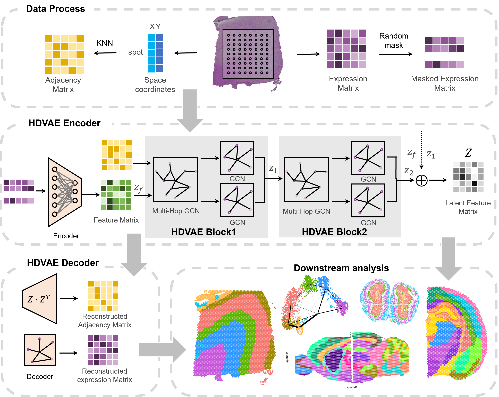

Welcome to HDVAE Tutorials
===========================================================================

HDVAE: identifying spatial domains in spatial transcriptomics data with Hierarchical Decoupled Variational Autoencoder
=================================================================================================================================================

.. toctree::
   :maxdepth: 1
   :caption: Tutorials:

   notebooks/Installation
   notebooks/1_DLPFC_Clustering
   notebooks/2_HBC_Clustering
   notebooks/3_MouseBrain_Clustering
   notebooks/4_Slide_seqV2_Clustering
   notebooks/5_Stereo_seq_Clustering
   notebooks/6_STARmap_Clustering
   notebooks/7_mouse_breast_CA_Batch_effects
   notebooks/8_mouse brain_Batch_effects
   notebooks/9_mouse_brain_anterior_posterior

Overview
========================
In this study, we proposed HDVAE (Hierarchical Decoupled Variational Autoencoder) which significantly improved the identification ability of the spatial domain in ST data through multi-hop graph convolution and hierarchical decoupling structure. Its core innovation lies in using multi-hop graph convolution to expand the receptive field of spots and capture long-distance spatial dependencies, while achieving hierarchical decoupling of local and global features through a series of HDVAE Blocks, and ensuring semantic consistency between levels by combining cross-level similarity constraints. Compared to other advanced methods, HDVAE shows significant advantages in tests on multiple platforms. The ARI on the human DLPFC dataset is improved to 0.7182, and the iLISI score of the batch effect correction task reaches 1.97. Moreover, the model, through lightweight variational inference and implicit multi-hop computation, reduces the CUDA memory occupation (only 239MB) while being compatible with single-cell high-resolution data (such as Stereo-seq) and large-scale tissue sections, verifying its cross-platform robustness. These advantages make HDVAE an advanced tool in the current field of spatial omics that combines both accuracy and efficiency.
